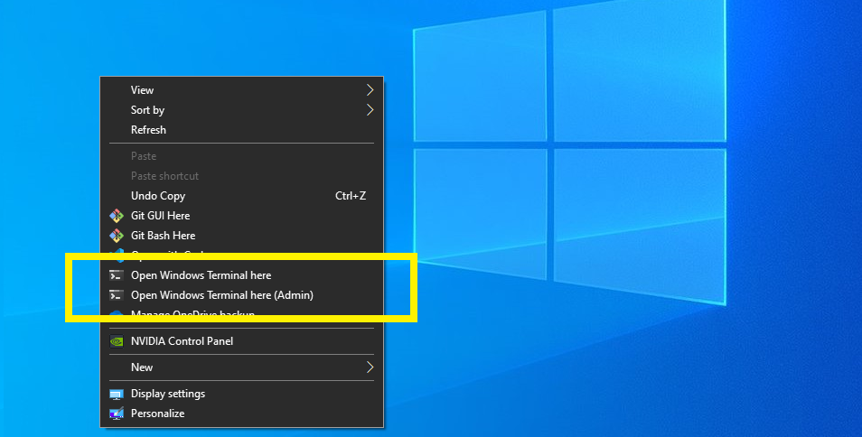

# WindowsTerminal RightClick Setup

Add [Windows Terminal](https://github.com/microsoft/terminal) Add "open Windows terminal here" into the right-click context menu.


## Windows Terminal Installation:
Install the [Windows Terminal from the Microsoft Store](https://aka.ms/terminal).
or use chocolatey https://chocolatey.org/.
```bash
choco install microsoft-windows-terminal -y
```
> 🔴 Note: Windows Terminal requires Windows 10 1903 (build 18362) or later


## Setup right-click context menu:
Clone and download this GitHub repo and open PowerShell as an administrator in the root directory.

Install:
```powershell
.\SetupWindowsTerminalRightClick.ps1
```
Remove:
```powershell
.\RemoveWindowsTerminalRightClick.ps1
```

## Donation:
If this script help you to complete any task, you can give me a cup of coffee :)

[](https://www.paypal.me/cmartinezone)
